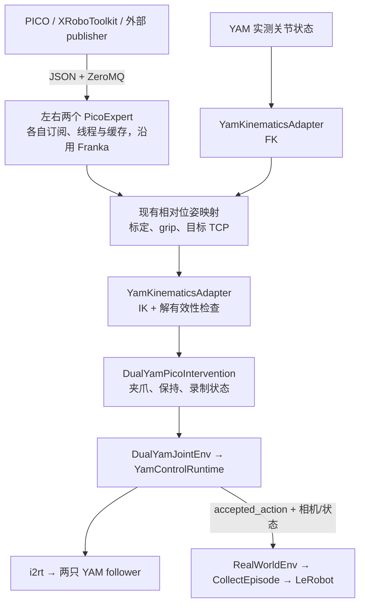

# YAM 在 RLinf 中接入 PICO VR 的实施计划

日期：2026-09-05。源码基准：`3554fd2c`。

本文是后续实现与验收计划，文中的新增文件、接口和配置均为拟议设计，不表示已经实现或经过真机验证。现有数据流分析见 [yam_vr_data_flow.md](yam_vr_data_flow.md)。

## 实施进展（第一版）

下文保留设计基准；当前工作区已实现双独立 PicoExpert、YAM/flexible_4310 实际模型
FK/IK、VR wrapper、夹爪与录制状态、工厂互斥检查、配置和离线诊断工具。

- P0：确认本地 i2rt commit 与清单一致，以及模型的六个机械臂关节和两个夹爪滑动关节；
  尚未检查现场 VR 数据和物理 TCP，未在全新虚拟环境重装验证。
- P1/P2：实际模型求解、失败拒绝、单手控制、双臂保持与重新接管已有离线测试。
- P3：两个 episode 的 LeRobot 写入/回读、丢弃片段和接受动作对齐已有测试；
  未验证真实相机/CAN/Ray 集群中的端到端采集。
- P4：仅做合成 VR + 模拟从臂时序检查；120 步无控制故障，单次 IK 约 0.5 ms，
  含节拍等待的整步约 33.4 ms，存在调度超期。它不证明真机 30 Hz 或硬实时要求已满足。

实现沿用 `PicoExpert.get_action()`，新增的公共方法仅用于清除参考和读取本实例按钮，
没有共享订阅或左右同帧要求。键盘回退使用显式选择的 Linux 输入设备（R/X），
模型首版仅接受 `yam + flexible_4310`，其他模型需要单独验证后扩展。
同时修正通用采集器的回放输出边界，使其与 LeRobot 一样跳过 `record_reset` 帧及
`pre_record` 阶段；PICO 关闭时先等待接收线程退出，再关闭其 ZeroMQ socket。

> rebase 到 PR #1481 之后，接收层已上移到 `rlinf/robotics/parts/transports/pico.py`，
> 该模块只提供 `get_reading()` / `get_buttons()`。YAM 侧由
> `rlinf/envs/real/yam/pico_intervention.py` 的 `_YamPicoArm` 承担原先
> `PicoExpert.get_action()` 的职责。本文其余部分（以及 `yam_vr_data_flow.md`）中
> 关于“接收与映射未拆分”“`pico_delta_to_tcp_pose`”“scheduler 硬件类型”的描述
> 属于重构前的设计基准，不再逐条对应现有代码。

复现入口：`python -m toolkits.realworld_check.test_yam_vr_pipeline --steps 120`
（VR → FK/IK 到 mock follower 的离线检查，不打开机器人）。
现场步骤见[中文 YAM 文档](source-zh/rst_source/examples/embodied/yam.rst)。

## 1. 目标与第一版范围

实现使用 PICO 左右手柄控制双臂 YAM，并通过现有 RLinf collector 保存可供 YAM OpenPI 训练使用的 LeRobot 数据。

第一版完成：

- 左手柄控制左从臂，右手柄控制右从臂，支持只接管一侧。
- 复用现有 PICO 位姿、坐标标定、相对运动映射与 grip 接管语义。
- 使用已安装 i2rt 的 `Kinematics` 实现 FK/IK，输出 YAM 14D 绝对关节目标。
- 支持夹爪开、关、保持，以及与运动接管独立的 episode 录制控制。
- 松手、无数据、无效位姿、IK 失败时采用明确的保持与重新接管行为。
- 保留已有相机、机器人观测、LeRobot 和 OpenPI 数据契约。

第一版以人工遥操作采集为目标。策略与专家混合执行、DAgger、头显视频回传、力反馈和自定义 IK 算法作为后续扩展，不作为本次闭环条件。

## 2. 已有实现与实际缺口

| 模块 | 当前已有能力 | 本次需要补齐 |
| --- | --- | --- |
| 外部 `pico_software` | XRoboToolkit 读取和 ZeroMQ JSON 发布 | 确认设备数据正常与配置地址 |
| `PicoExpert` | 接收、标定、接管参考、末端 delta action | 沿用左右两个独立实例，通过现有 `get_action()` 接入 YAM |
| i2rt `Kinematics` | MuJoCo + Mink 的 FK/IK | 实际 YAM/夹爪模型适配、关节索引、TCP 与求解失败处理 |
| `DualYamJointEnv` | 14D 关节动作、相机观测、复位、保持 | 装配 VR wrapper；必要时增加公开状态读取接口 |
| `YamControlRuntime` | follower 唯一命令入口、反馈检查、限位与限步长 | VR 路径强制启用现有限制，报告实际接受目标 |
| `DualYamLeaderIntervention` | 电机主臂遥操作与录制边界 | 提取或复用录制语义，避免 VR 打开 leader CAN |
| `CollectEpisode` | episode 缓存与 LeRobot 导出 | 验证 VR 接管动作覆盖与录制边界对齐 |

本地 SDK 的 IK 位于 `.venv/lib/python3.11/site-packages/i2rt/robots/kinematics.py`，这属于依赖，不是 RLinf 已集成的功能。依赖清单固定了 i2rt commit；实施前必须确认安装版本与清单一致，不能仅凭当前虚拟环境有该文件就判断新环境可复现。

## 3. 目标架构



所有机器人命令继续通过 `YamControlRuntime`。VR 接收线程只接收数据；IK 层只计算目标；二者不直接打开 CAN 或写电机。沿用环境当前相机预热和 follower 启动顺序。

## 4. 接口与数据契约

### 4.1 外部 VR 消息

沿用现有字段：`headset_pose`、`left_controller`、`right_controller`、`buttons`、`timestamp_ns`。位置采用米，四元数采用 `[qx,qy,qz,qw]`。

第一版沿用 Franka 的双实例结构：左侧 `PicoExpert(hand="left")` 和右侧 `PicoExpert(hand="right")` 分别订阅同一 publisher，各自维护接收线程和缓存。机器人每步分别调用两侧 `get_action()`，不要求左右手取到同一个消息包。接收线程不执行模型计算。

沿用现有 `PicoExpert` 的位姿、接管与数据过期判断，并在 YAM 适配层检查返回目标和 IK 输入输出的形状及有限值。第一版明确接受以下现有接收层限制：

- 左右手可能读取不同消息帧，尚未测量其时间差。
- 过期判断基于各自接收机器上的 `time.time()`，不使用源 `timestamp_ns`。
- 现有控制器字段缺失时存在默认值回退，接收就绪不代表完整协议和跟踪质量已验证；P0 必须确认 publisher 持续提供有效的左右控制器字段。
- publisher 持续发送旧跟踪数据时，现有接收超时机制不能识别数据冻结。

共享快照、单调时钟、源时间戳推进检查和跟踪有效标志列为后续可选优化，根据实测需求另行实施，不作为第一版前置条件或验收项。

### 4.2 VR 到末端目标

直接复用每侧 `PicoExpert.get_action()`，第一版不拆分接收与映射、不新增共享消息入口。YAM 为各侧提供由 FK 得到的当前 TCP 和明确的动作尺度。

调用形式：

```python
expert_action, replaced, info = expert.get_action(
    tcp_pose=tcp_pose_xyzw,
    action_scale=action_scale,
    gripper_enabled=True,
)
# expert_action: [dx, dy, dz, rx, ry, rz, gripper]
# 前六维为归一化增量，旋转为 rotvec；仅 replaced=True 时采用。
```

YAM wrapper 将增量乘回平移/旋转尺度，平移加到当前 TCP 位置，rotvec 对应旋转左乘当前 TCP 姿态，得到用于 IK 的绝对目标。不能把 rotvec 当 Euler，也不能先转成 Franka 专用 action 再交给 YAM。

YAM 位姿转换不调用 `_target_tcp_pose()` 等私有计算方法。单元测试通过注入 fake expert 验证 YAM 适配；如 reset/故障恢复需要清除接管参考，可最小化补充公开生命周期接口并做 Franka 回归验证，不改变双实例接收结构。

### 4.3 YAM 运动学适配

拟议新增 `YamKinematicsAdapter`，每侧独立实例，避免 SDK 内部可变 configuration 被左右臂或线程共享。

```python
tcp_pose = kin.fk(q_arm, gripper_position)
result = kin.solve(target_tcp_pose, q_seed, gripper_position)
# result: success、q_target、position_error、rotation_error、elapsed_s、reason
```

输入关节均为单臂 6D 弧度值；输出 `q_target` 固定为单臂 6D。适配器内部负责映射到 SDK 模型的完整 qpos，并从解中按关节名称提取机械臂关节。

模型与 TCP 要求：

- 依据硬件 `arm_type`、`gripper_type` 加载与现场一致的模型；当前站点为 YAM + flexible_4310，应核对实际版本。
- 核验 `grasp_site` 或选定 site 对应的物理 TCP，明确工具偏移；不能使用 `NO_GRIPPER` 测试模型直接代表带夹爪的真机 TCP。
- 查清模型 `nq/nv`、机械臂与夹爪关节名称、归一化夹爪值到模型关节位置的映射。
- 求解期间固定不应由 IK 改变的夹爪自由度，不能依靠截取前 6 个数掩盖模型不匹配。
- 明确每侧机器人基座到操作者参考系的变换；第一版可沿用每手 yaw 配置，但必须显式记录并验证其适用的安装条件。

SDK `ik()` 接受 4×4 绝对目标矩阵，返回 `(success, q)`。使用当前实测关节作为初值，显式设置迭代上限、误差阈值及限制；失败时即使返回 q，也不得下发。

求解后重新 FK 验证目标误差，检查有限值、关节限制和相对实测关节的跳变。不能仅信任 success 标志，也不能假定 SDK 默认约束包含双臂碰撞或现场障碍物。

### 4.4 机器人动作与训练数据

YAM action 保持：

```text
[L_q0..q5, L_gripper, R_q0..q5, R_gripper]
shape = (14,)
关节 = 绝对弧度位置；夹爪 = [0,1]，0 全闭、1 全开
```

`state` 继续是机器人实测值，`actions` 是运行时接受的目标，不把 VR pose 写进原来的 state/action 槽位。

每步先调用底层环境，读取 `info["accepted_action"]`，再设置 `info["intervene_action"]`。该字段代表 RLinf 接受的命令目标，不等同于电机实际到达位置。

## 5. 接管、夹爪和录制状态

### 5.1 每只手的控制状态

| 状态/事件 | 控制行为 | 恢复条件 |
| --- | --- | --- |
| 尚未标定或等待数据 | 保持当前实测关节位置 | 有效数据、完成标定 |
| grip 由松开变为握住 | 记录手柄与当前 TCP 参考，接管首步无位移 | 后续有效帧跟随相对运动 |
| grip 持续握住 | 末端目标限步长 → IK → 关节命令 | 正常连续控制 |
| 松开 grip | 保持该臂当前实测位置，清除参考 | 再次握住时重新建立参考 |
| 接收超时、已检测到的位姿无效 | 两臂保持，清除活动参考，进入故障锁存 | 数据恢复后先释放 grip，再重新握住 |
| IK 失败、非有限解或目标跳变 | 两臂保持并报告原因，不下发失败解 | 释放再握住后重新建立参考 |
| 配置复位或环境 reset | 清除接管参考和故障前命令缓存 | 复位完成后重新接管 |

第一版把数据故障或 IK 故障作为双臂共同保持事件，防止双臂协作时仅一侧意外继续。正常情况下允许单手操作，未接管侧保持位置。

记录有限的故障计数与原因，避免控制循环逐帧刷日志。关闭和异常退出沿用运行时的保持与资源释放逻辑。

### 5.2 夹爪与按钮分配

- grip 用于接管；trigger 用于坐标标定。
- 左手 X/Y 关闭/打开左夹爪，右手 A/B 关闭/打开右夹爪。
- 没有夹爪按钮时保持已建立目标；首次初始化或故障恢复时由实测位置初始化。
- 第一版仅在该手接管时接受其夹爪开关命令，避免未接管手柄意外改变夹爪。
- 录制控制采用可配置、独立于上述按键的按钮；建议右菜单切换录制/成功结束，左菜单丢弃当前片段。实际设备是否暴露这些按钮在数据检查阶段确认，并提供终端键盘回退。
- 录制按键使用上升沿与消抖；不得因按住按钮重复结束 episode。

### 5.3 episode 边界

第一版选择显式录制状态：预览/等待录制、录制中、完成或丢弃。停止录制不自动移动机械臂，不自动取消正常遥操作。

复用现有 YAM 主臂采集的 `record_reset`、`episode_phase` 等协议前，先追踪其在 collector 中的处理。VR 等待录制期间需要持续读取输入并驱动遥操作，但不积累待保存帧；不能让阻塞的 collector reset 停止控制更新。

手动录制边界后的自动 reset 可以保留正常握持状态与参考；显式复位、提前 reset、故障及程序重新启动必须清除参考。该差别通过明确的边界标志表达，避免仅凭 grip 仍按住就恢复旧目标。

发生数据或求解故障时将当前录制标记为无效，不把故障保持过程自动算成成功演示。下一次录制从新的当前观测开始。

## 6. 配置与文件组织

拟议统一使用 `env.eval.use_pico` 和 `env.eval.pico` 作为 VR 入口；现有 `override_cfg.leader_intervention` 保留。YAM 工厂校验两种遥操作互斥，在打开硬件前拒绝冲突配置。

VR 示例独立于现有主臂采集配置，强制 `enforce_runtime_joint_limits: true`。沿用 30 Hz 目标频率，但不照搬现有主臂采集关闭限位的设置。

拟议新增/修改文件：

| 文件 | 工作内容 |
| --- | --- |
| `rlinf/envs/real/yam/kinematics.py` | SDK 运动学适配、模型映射、IK 结果检查 |
| `rlinf/envs/real/yam/pico_intervention.py` | 双臂 VR 控制、夹爪、故障与录制状态 |
| `rlinf/envs/real/yam/config.py` | YAM VR/IK 配置与数值校验 |
| `rlinf/envs/real/yam/tasks/__init__.py` | VR 装配、遥操作互斥、启动前校验 |
| `rlinf/robotics/parts/transports/pico.py` | 复用现有双实例结构；仅在必要时补充公开接管生命周期接口 |
| `examples/embodiment/config/realworld_dual_yam_collect_data_pico.yaml` | VR 采集示例，使用站点变量配置设备地址 |
| `toolkits/realworld_check/test_yam_vr_pipeline.py` | 默认不打开硬件的 VR → FK/IK 检查 |
| `tests/unit_tests/test_yam_kinematics.py` | 真实模型的 FK/IK 契约测试 |
| `tests/unit_tests/test_yam_pico_intervention.py` | 接管、保持、夹爪、失败与录制状态测试 |
| `tests/unit_tests/test_yam_examples.py` | 新配置组合与互斥验证 |
| `requirements/embodied/envs/yam.txt` | 根据可复现检查补齐 VR/IK 依赖及兼容版本 |
| 中英文 YAM 文档、`docs/yam_vr_data_flow.md` | 操作步骤、格式与实际实现边界 |

暂不固定数值调参。配置必须显式涵盖：手柄增益、接管阈值、数据过期时间、每步最大 TCP 位移/旋转、IK 迭代上限与误差阈值、关节最大变化、每手基座朝向及 TCP/site。

## 7. 分阶段实施与验收

### P0：依赖、模型与协议核验

- 核对固定 i2rt commit 与本地安装来源，确认 Mink、MuJoCo、QP 求解器和 pyzmq 可在新 YAM 环境导入。
- 读取实际夹爪模型，确定 TCP、qpos 索引、夹爪映射以及机械臂关节限制。
- 用现有 `test_pico_data.py` 检查左右手、按钮、时间戳和数据更新，不打开机器人。
- 检查已有 collector 的开始/结束、丢弃与 reset 协议。

验收：给出可复现的模型与依赖信息、按钮映射及字段样例；明确模型 TCP 和现场工具一致。若某项无法确认，仍可推进 mock/离线实现，但不将其标记为真机可用。

### P1：独立运动学适配

- 实现 `YamKinematicsAdapter`，延迟导入重依赖；离线工具和硬件枚举不能因未安装 IK 依赖而无条件失败。
- 在实际夹爪模型上测试 FK → 扰动目标 → IK → FK，使用固定可复现样本。
- 覆盖不可达目标、边界、姿态变化、非有限输入、夹爪自由度保持和双实例隔离。
- 记录位置/姿态误差、求解耗时及关节变化，不连接 CAN。

验收：满足配置的误差阈值；失败结果不被当作成功；输出严格为 6D 机械臂关节，双臂调用不污染彼此状态。

### P2：VR 到关节的离线闭环

- 创建左右两个独立 `PicoExpert`，通过现有 `get_action()` 和每手 FK TCP 接入位姿映射。
- 实现目标限步长、IK 求解、夹爪语义与接管/故障状态。
- 通过 mock follower 或纯离线模型验证手柄平移和旋转方向。
- 验证第一次接管、重新接管、标定和故障恢复没有旧参考引发的跳变。

验收：无需机器人即可输出可解释的 14D 目标；左右 expert 分别控制正确的手臂；未接管与失败分支均保持；订阅与线程正常释放；如有公共生命周期改动，Franka 原有动作含义不变。

### P3：RLinf 环境与采集闭环

- 在 YAM 工厂装配 VR wrapper，拒绝与电机 leader 同时启用。
- 接入录制状态、collector reset 协议和 `accepted_action` 报告。
- 用 mock 环境连续录制至少两个 episode，含松手、单手接管、夹爪开关和丢弃片段。
- 读取生成的 LeRobot shard，核验状态/动作/相机对应、首末帧和接管标志。

验收：VR 模式不打开 leader CAN；LeRobot `state/actions` 均为 14D；保存动作等于运行时接受目标；故障与丢弃片段不会被保存成成功演示。现有 YAM OpenPI 输入适配能够读取该数据结构。

### P4：控制机时序与真机验收

- 先在控制机离线测量双臂 IK 和整步耗时，再进行现场单臂低增益验证，最后验证双臂与录制。
- 目标频率为 30 Hz，对应约 33.3 ms 整步预算；记录 p50/p95/p99、最大耗时及超期次数，不能把 IK 的 `dt=0.01` 当作实际求解耗时。
- SDK IK 是同步迭代调用；返回后检查耗时不能保证调用期间的硬截止时间。若长尾不能满足预算，先降低迭代上限或控制频率并复测；若仍不满足，需增加可中止的分步求解或受控异步设计，并重新验证过期结果丢弃。
- 真机阶段验证 TCP 定义、运动方向、夹爪语义、松手保持、拔除 VR 链路、IK 失败、复位与异常关闭。
- 使用现场已验证的运动区域；当前独立单臂 IK 不提供双臂互碰或场景碰撞保证。需跨臂交接的任务，应先增加相应几何验证与约束。

验收：实测频率和延迟满足明确记录的运行配置；异常分支可重复验证；完成连续多段 VR 演示，数据能被现有转换/读取链路正常消费。记录实际设备、模型、配置与限制，不仅记录“测试通过”。

## 8. 必要验证清单

- [ ] 固定依赖环境可导入并构建实际 YAM/夹爪模型。
- [ ] TCP/site、模型 qpos 与真实关节/夹爪映射已确认。
- [ ] FK/IK 回环、不可达目标与关节跳变检查通过。
- [ ] 坐标方向、旋转表示与动作尺度没有混用。
- [ ] 两个独立 PicoExpert 分别控制正确的手臂，单侧接管不移动另一侧。
- [ ] 首次接管、释放再接管、reset 后没有目标跳变。
- [ ] VR 接收超时、已检测到的无效位姿或 IK 失败后保持并要求重新接管。
- [ ] 松开夹爪按钮保持目标，不将 0 错当作保持。
- [ ] VR 与 leader 模式互斥，VR 模式不连接 leader CAN。
- [ ] 录制边界、丢弃、故障片段和 collector reset 语义正确。
- [ ] LeRobot 保存的是 `accepted_action`，状态与动作执行前观测对齐。
- [ ] Franka PICO 与已有 YAM leader 路径无回归。
- [ ] 控制机实测时序与真机结果记录完整。

## 9. 完成后的交付物

交付可复现的 VR 采集配置、YAM 运动学适配与 VR wrapper、离线诊断工具、针对行为的测试和中英文使用说明；另记录实际机器上的模型/TCP 信息、控制时序与真机验收结果。

按“运动学适配 → VR 控制 → 采集闭环 → 验收文档”组织后续提交。第一版实施状态见文首，
当前未启动真实 VR、CAN 或相机，硬件验收不计为已完成。
