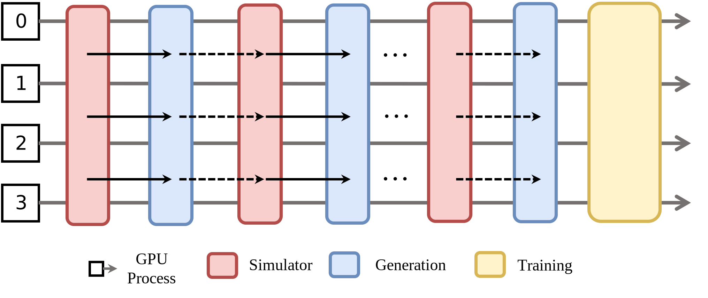

Flexible Execution Modes
========================

RLinf supports three execution modes that determine how workers are placed across GPUs
and how they coordinate during training. This page covers all three modes and their trade-offs.

.. contents::
   :depth: 1
   :local:

Collocated Mode
---------------

All workers are scheduled on the *same* set of GPUs.  During any stage
only one type of worker runs and occupies the entire devices' computation capability until that
stage finishes. There are two execution modes: residing in GPU memory simultaneously or switching residence in GPU memory with offloading/reloading.

**Pros**

* Simple design; no complex data-dependency management.

**Cons**

* Often requiring offloading/reloading implementation for each component.
* Long-tail latency in the rollout stage extends end2end RL training time.

**Example configuration**

The following is an example of placing workers. There are two nodes for this training job, each node has 8 GPUs. `actor` uses all the 16 GPUs and `rollout` also uses all the 16 GPUs:

.. code:: yaml

   cluster:
     num_nodes: 2
     component_placement:
       actor,rollout: all # or 0-15

Additonally, some workers support offloading to release GPUs to other workers during some time period. For example, math RL actor support some offloading options:

.. code:: yaml

   actor:
     offload_optimizer: True
     offload_weight: True
     offload_grad: True

If offloading is enabled for actor, the actor is loaded into GPU memory before it runs, then it is offloaded into CPU memory after it finishes its execution. If offloading is not enabled, the collocated workers (assuming workers run on GPUs) will compete for GPU memory, which may lead to OOM error.
Refer to :doc:`../guides/basic_config` for the complete configuration.

**ComponentPlacement programming**

Given the above placement configuration, users can use proper `ComponentPlacement` class to parse the configuration and enforce the placement to the workers as below.

.. code:: python

   from rlinf.utils.placement import ModelParallelComponentPlacement, PlacementMode

   component_placement = ModelParallelComponentPlacement(cfg, cluster)
   rollout_placement_strategy = component_placement.get_strategy("rollout")
   rollout_group = SGLangWorker.create_group(cfg, component_placement).launch(
        cluster,
        name=cfg.rollout.group_name,
        placement_strategy=rollout_placement_strategy,
    )

`ModelParallelComponentPlacement` supports two types of placement: collocated and disaggregated. More importantly, it deals with rank arrangement that allows efficient model weight update from training to rollout. It parses the configuration and generates placements for different components. The generated placement is then enforced during worker launching.
Refer to `Math RL training python script <https://github.com/RLinf/RLinf/blob/main/examples/reasoning/main_grpo.py>`_ for the complete code.

Disaggregated Mode
------------------

.. image:: ../../_static/svg/disaggregated.svg
   :width: 600px
   :align: center
   :class: dis-img

Different RL tasks are mapped to different GPU groups according to their computation needs. There also two execution modes: the workers run sequentially one after another or the workers run concurrently with fine-grained pipelining.

**Pros**

* Flexible worker assignment.
* No requirement for offloading implementation.

**Cons**

* Data-flow dependencies lead to GPUs idle.
* Pipelining should be implemented to reduce GPU idle time.

**Example configuration**

The workers are assigned to separate GPUs. The set of GPUs is specified using global GPU indices.

.. code:: yaml

   cluster:
     num_nodes: 2
     component_placement:
       rollout: 0-9
       inference: 10-11
       actor: 12-15

.. note::
   The ``pipeline_stage_num`` configuration should be adjusted to achieve the desired pipelining effect.

Refer to :doc:`../guides/basic_config` for complete configuration.

**ComponentPlacement programming**

As described in Collocated Mode, the placement configuration in the yaml file can be parsed by `ComponentPlacement` and enforced on workers. Refer to `Math RL training with pipelining <https://github.com/RLinf/RLinf/blob/main/examples/reasoning/main_grpo.py>`_ for the complete code.

Hybrid Mode
-----------

.. image:: ../../_static/svg/hybrid.svg
   :width: 600px
   :align: center
   :class: hyb-img

RLinf further augments the collocated mode and disaggregated mode, by introducing hybrid mode: some tasks share the same set of GPUs and some tasks use separate GPUs.

The above figure shows a concrete placement and execution example for an embodied RL training.
Simulation workers are placed on GPU 0-1, generation workers are placed on GPU 2-3. Two *data queues* decouple producer and consumer rates,
helping to smooth the pipeline, balance the load, and virtually eliminate performance bottlenecks.After the rollout stage (i.e., simulation+generation), Inference workers are placed and executed on GPU 0-3, and training workers are also on GPU 0-3 afterward. You can see that hybrid mode combines collocated mode and disaggregated mode. The communication utilities in RLinf facilitate such flexible placement and execution mode.

**Example configuration**

The configuration style of hybrid mode is consistent to collocated/disaggregated mode as shown below. `env` (i.e., simulator workers) is placed on GPU 0-3, `rollout` (i.e., generation workers) is placed on GPU 4-7. They run with pipelining. `actor` (i.e., training workers) are placed on GPU 0-7. When the rollout stage is finished, `env` and `rollout` are offloaded to CPU memory, `actor` is loaded into GPU memory.

.. code:: yaml

  cluster:
    num_nodes: 1
    component_placement:
      actor: 0-7
      env: 0-3
      rollout: 4-7

In most cases, `env`, `rollout`, and `actor` should enable offloading as below to avoid OOM error.

.. code:: yaml

   env:
     enable_offload: True
   rollout:
     enable_offload: True
   actor:
     enable_offload: True

.. note::
   The ``pipeline_stage_num`` configuration should be adjusted to achieve the desired pipelining effect. For embodied RL training, it is recommended to set ``pipeline_stage_num`` to ``2`` for Hybrid Mode to enable pipeline overlap between rollout and env.

Refer to :doc:`../guides/basic_config` for complete configuration.

**ComponentPlacement programming**

Different from collocated and disaggregated modes, hybrid mode uses `HybridComponentPlacement`, which has less constraints on worker placement.

.. code:: python

   from rlinf.utils.placement import HybridComponentPlacement

   component_placement = HybridComponentPlacement(cfg, cluster)
   # Create actor worker group
   actor_placement = component_placement.get_strategy("actor")
   actor_group = FSDPActor.create_group(cfg).launch(
        cluster, name=cfg.actor.group_name, placement_strategy=actor_placement
    )

Refer to `training embodied agent <https://github.com/RLinf/RLinf/blob/main/examples/embodiment/train_embodied_agent.py>`_ for complete code.
