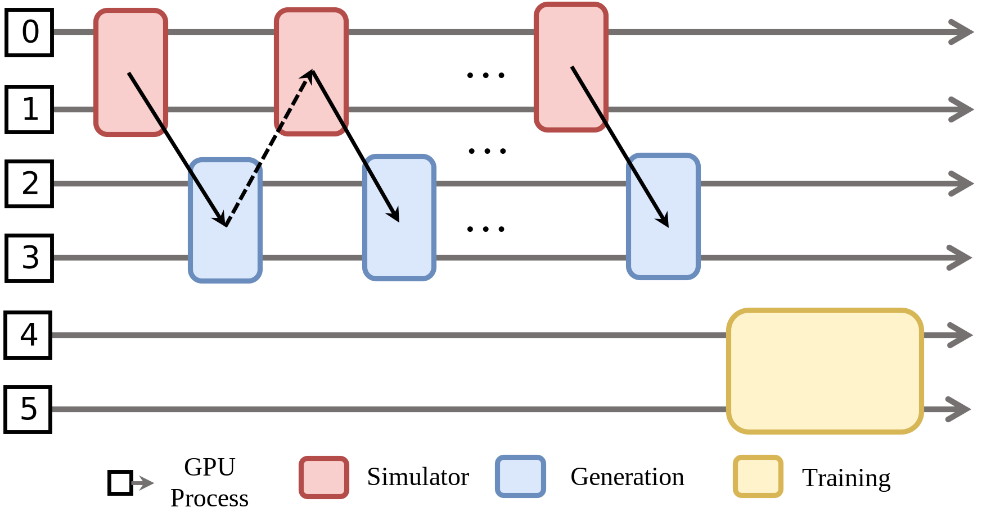
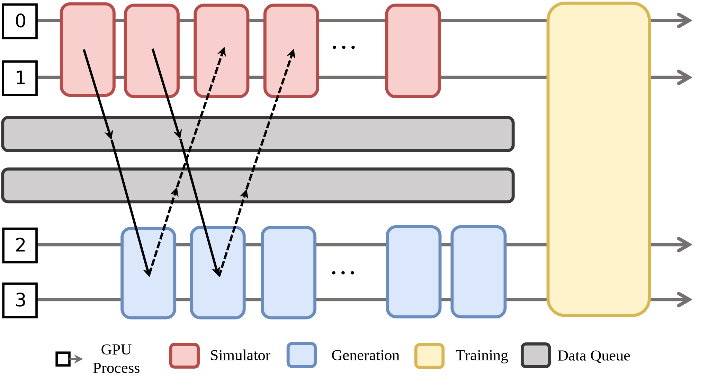

灵活执行模式
=============

RLinf 支持三种执行模式，决定 Worker 如何在 GPU 之间放置以及训练过程中如何协调。
本页面涵盖全部三种模式及其权衡。

.. contents::
   :depth: 1
   :local:

共享式模式
----------

.. image:: ../../../_static/svg/collocate.svg
   :width: 600px
   :align: center
   :class: col-img

所有 Worker 都被调度到 **同一组** GPU 上。在任意阶段，
只有一种类型的 Worker 运行，并占用整个设备的计算能力，直到该阶段结束。
这里有两种执行模式：同时常驻于 GPU 内存，或者通过卸载/重新加载在 GPU 内存中切换驻留。

**优点**

* 设计简单；无需复杂的数据依赖管理。

**缺点**

* 通常需要为每个组件实现卸载/重新加载。
* rollout 阶段的长尾延迟会延长端到端 RL 训练时间。

**示例配置**

下面是一个 Worker 放置的示例配置。本次训练任务有两个节点，每个节点有 8 个 GPU。`actor` 使用所有 16 个 GPU，`rollout` 也使用所有 16 个 GPU：

.. code:: yaml

   cluster:
     num_nodes: 2
     component_placement:
       actor,rollout: all # or 0-15

另外，一些 Worker 支持卸载，以在某些时间段释放 GPU 给其他 Worker 使用。
例如，math RL actor 支持一些卸载选项：

.. code:: yaml

   actor:
     offload_optimizer: True
     offload_weight: True
     offload_grad: True

如果为 actor 启用了卸载，actor 会在运行前被加载到 GPU 内存中，运行结束后再被卸载到 CPU 内存。
如果没有启用卸载，共享式的 Worker（假设运行在 GPU 上）会争夺 GPU 内存，可能导致 OOM 错误。
完整配置请参考 :doc:`../configuration/basic_config`。

**ComponentPlacement 编程**

基于以上的放置配置，用户可以使用合适的 `ComponentPlacement` 类来解析配置，
并将放置策略应用到 Worker，如下所示：

.. code:: python

   from rlinf.utils.placement import ModelParallelComponentPlacement, PlacementMode

   component_placement = ModelParallelComponentPlacement(cfg, cluster)
   rollout_placement_strategy = component_placement.get_strategy("rollout")
   rollout_group = SGLangWorker.create_group(cfg, component_placement).launch(
        cluster,
        name=cfg.rollout.group_name,
        placement_strategy=rollout_placement_strategy,
    )

`ModelParallelComponentPlacement` 支持两种放置方式：共享式和分离式。
更重要的是，它会处理 rank 的排列，从而实现从训练到 rollout 的高效模型权重更新。
它会解析配置并为不同组件生成放置策略。生成的放置策略会在 Worker 启动时生效。
完整代码请参考 `Math RL 训练代码 <https://github.com/RLinf/RLinf/blob/main/examples/reasoning/main_grpo.py>`_。

分离式模式
----------

不同的 RL 任务会根据计算需求映射到不同的 GPU 组。这里也有两种执行模式：
Worker 可以顺序依次运行，或者通过细粒度流水线并发运行。

**优点**

* Worker 分配灵活。
* 不需要实现卸载功能。

**缺点**

* 数据流依赖会导致 GPU 空闲。
* 需要实现流水线来减少 GPU 空闲时间。

**示例配置**

Worker 被分配到不同的 GPU 上。GPU 集合通过全局 GPU 索引指定。

.. code:: yaml

   cluster:
     num_nodes: 2
     component_placement:
       rollout: 0-9
       inference: 10-11
       actor: 12-15

.. note::
   ``pipeline_stage_num`` 配置应调整以实现所需的流水线效果。

完整配置请参考 :doc:`../configuration/basic_config`。

**ComponentPlacement 编程**

如共享式模式中所描述，yaml 文件中的放置配置可以通过 `ComponentPlacement` 解析，
并应用到 Worker 上。完整代码请参考
`Math RL 细粒度流水训练代码 <https://github.com/RLinf/RLinf/blob/main/examples/reasoning/main_grpo.py>`_。

混合式模式
----------

RLinf 在共享式模式和分离式模式的基础上，进一步引入了混合式模式：
有些任务共享同一组 GPU，而有些任务使用独立的 GPU。

上图展示了一个具身 RL 训练的具体放置与执行示例。
仿真 Worker 被放置在 GPU 0-1 上，生成 Worker 被放置在 GPU 2-3 上。两个 *数据队列* 将生产者和消费者的速率解耦，帮助平滑流水线、平衡负载，并几乎消除性能瓶颈。在 rollout 阶段（即仿真+生成）结束后，推理 Worker 被放置并运行在 GPU 0-3 上，随后训练 Worker 也运行在 GPU 0-3 上。可以看到，混合式模式结合了共享式和分离式模式。RLinf 中的通信工具支持这种灵活的放置和执行方式。

**示例配置**

混合式模式的配置风格与共享式/分离式模式一致，如下所示：
`env` （即仿真 Worker）放置在 GPU 0-3 上，`rollout` （即生成 Worker）放置在 GPU 4-7 上，它们通过流水线运行。`actor` （即训练 Worker）放置在 GPU 0-7 上。当 rollout 阶段结束后，`env` 和 `rollout` 会卸载到 CPU 内存，`actor` 会加载到 GPU 内存。

.. code:: yaml

  cluster:
    num_nodes: 1
    component_placement:
      actor: 0-7
      env: 0-3
      rollout: 4-7

在大多数情况下，`env`、`rollout` 和 `actor` 应该启用如下的卸载功能，以避免 OOM 错误。

.. code:: yaml

   env:
     enable_offload: True
   rollout:
     enable_offload: True
   actor:
     enable_offload: True

.. note::
   ``pipeline_stage_num`` 配置应调整以实现所需的流水线效果。
   对于具身RL训练，建议在混合模式设置为 2，以实现 rollout 和 env 之间的流水线重叠。

完整配置请参考 :doc:`../configuration/basic_config`。

**ComponentPlacement 编程**

与共享式和分离式模式不同，混合式模式使用 `HybridComponentPlacement`，
它对 Worker 放置的限制更少。

.. code:: python

   from rlinf.utils.placement import HybridComponentPlacement

   component_placement = HybridComponentPlacement(cfg, cluster)
   # 创建 actor Worker 组
   actor_placement = component_placement.get_strategy("actor")
   actor_group = FSDPActor.create_group(cfg).launch(
        cluster, name=cfg.actor.group_name, placement_strategy=actor_placement
    )

完整代码请参考
`具身模型训练 <https://github.com/RLinf/RLinf/blob/main/examples/embodiment/train_embodied_agent.py>`_。
