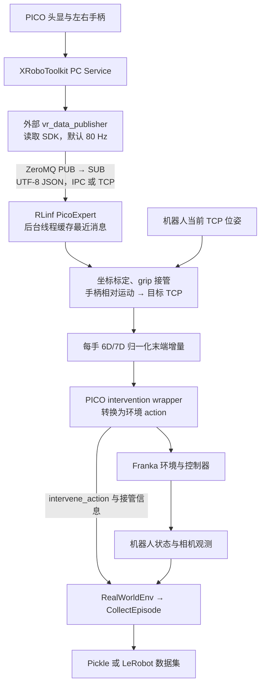

# RLinf VR 数据流、数据格式与 YAM 接入分析

本文整理 RLinf 当前 PICO VR 接入的数据链路、各阶段数据格式，以及在双臂 YAM 上复用该链路需要补齐的接口。

- 核对日期：2026-09-05。
- 本地源码基准：`3554fd2c`，`feat(realworld): extend YAM collection and deployment`。
- 范围：源码与文档分析，未连接 VR 或机器人验证。
- 外部文档和 publisher 链接指向在线版本，其内容可能继续更新。

RLinf 已经具备 PICO 数据接收、坐标转换、接管判断和 Franka 动作适配。YAM 接入的主要缺口是把 VR 末端运动转换为 YAM 关节目标，并处理夹爪、控制权和录制状态。网络 VR 消息、机器人控制 action、训练数据是三个不同层次，不能仅按向量维数判断是否兼容。

> 后续实现更新：当前工作区已新增 `yam/kinematics.py`，VR 控制则在
> `rlinf/robotics/parts/teleop/yam_pico.py` 的 `yam_pico` 设备中，录制/丢弃状态在
> `yam/pico_episode.py`；配置用 `teleop: yam_pico`（`use_pico` 已退役）。采用两个
> 独立 PicoExpert 和 i2rt FK/IK，保留 14D 数据契约。下文第 8 节的“缺口”描述的是
> `3554fd2c` 分析基准；实现进度与未完成的真机验收见 [plan.md](plan.md)。

## 1. 完整数据流与进程边界



头显连接、SDK 读取和 publisher 属于 RLinf 外部进程。RLinf 从 ZeroMQ 订阅开始接入，部署时需先启动外部服务与 publisher。[官方 VR 接入文档](https://rlinf.readthedocs.io/zh-cn/latest/rst_source/examples/embodied/franka_vr.html)

VR JSON 通道传输位姿与按键。机器人相机图像由环境自己的相机链路采集，不包含在该 VR 消息中。

## 2. 原始 VR 消息格式

发布端每次发送一条完整 JSON，包含头显、左右控制器和按键。以下数值仅为格式示例：

```json
{
  "timestamp_ns": 123456789000,
  "headset_pose": [0.0, 1.6, 0.0, 0.0, 0.0, 0.0, 1.0],
  "left_controller": {
    "timestamp_ns": 123456789000,
    "position": [-0.3, 1.1, -0.4],
    "orientation": [0.0, 0.0, 0.0, 1.0],
    "trigger": 0.0,
    "grip": 0.95,
    "axis": [0.0, 0.0]
  },
  "right_controller": {
    "timestamp_ns": 123456789000,
    "position": [0.3, 1.1, -0.4],
    "orientation": [0.0, 0.0, 0.0, 1.0],
    "trigger": 0.0,
    "grip": 0.95,
    "axis": [0.0, 0.0]
  },
  "buttons": {
    "A": false,
    "B": false,
    "X": false,
    "Y": false,
    "left_menu_button": false,
    "right_menu_button": false,
    "left_axis_click": false,
    "right_axis_click": false
  }
}
```

字段定义见发布端 [vr_message.py](https://github.com/tiny-xie/pico_software/blob/main/vr_message.py)。

| 字段 | 格式与含义 | 当前 RLinf 用途 |
| --- | --- | --- |
| `headset_pose` | `[x,y,z,qx,qy,qz,qw]` | 标定操作者位置与朝向 |
| `position` | 控制器三维位置 | 计算平移相对量 |
| `orientation` | 四元数，顺序为 **xyzw** | 计算旋转相对量 |
| `grip` | 模拟握持值，通常为 0～1 | 默认用于接管 |
| `trigger` | 模拟扳机值，通常为 0～1 | 示例配置用于标定 |
| `axis` | 二维摇杆值 | 当前 `PicoExpert` 未使用 |
| `buttons` | 名称到布尔值的映射 | 夹爪、标定或可配置的接管按键 |
| `timestamp_ns` | SDK 纳秒时间戳 | 当前 consumer 未用于同步或过期判断 |

位置进入 RLinf 后直接参与 TCP 位移计算，没有毫米到米的转换。对接其他 VR 发布端时，需保证位置尺度与机器人使用的米一致。

## 3. ZeroMQ 传输与接收缓存

传输过程为：

```text
publisher: JSON → UTF-8 bytes → socket.send(...)
consumer:  socket.recv() → UTF-8 decode → json.loads(...)
```

消息没有 topic 前缀，也不是 multipart。发布端默认 80 Hz，使用 PUB socket 并绑定地址；RLinf 使用 SUB socket，订阅全部消息并连接地址。发布端代码见 [vr_data_publisher.py](https://github.com/tiny-xie/pico_software/blob/main/vr_data_publisher.py)。

```text
同机：
  publisher bind / consumer connect：ipc:///tmp/vr_data.ipc

跨机：
  publisher bind：tcp://0.0.0.0:5555
  consumer connect：tcp://发布端IP:5555
```

接收实现位于 [pico_expert.py](../rlinf/robotics/parts/transports/pico.py)。每个 `PicoExpert` 建立一个订阅 socket，后台线程持续接收并更新：

```python
_latest_data       # 最近一次接收到的 JSON 字典
_last_update_time  # 接收机器上的 time.time()
```

环境执行每一步时通过 `get_action()` 读取缓存。VR 发布频率和机器人 step 频率独立，不是每个 VR 包都会产生一个机器人 step。

当前实现的有效性与时序行为如下：

- 默认 `max_stale_s=0.25`；双臂 PICO 采集示例为 `0.2` 秒。
- 过期依据是本机最近一次收到消息的时间，不是消息中的 `timestamp_ns`。
- 当前没有基于源时间戳的重排、相机同步或轨迹插值。
- 位姿检查要求数值有限，四元数模长与 1 的误差小于 `1e-3`。
- `hand: dual` 创建两个 `PicoExpert`，分别订阅同一完整消息流，并各自读取左右手字段；没有强制两手使用同一时间戳消息。
- 订阅端设置高水位为 10；后台缓存保存最近处理的消息，但没有基于源时间戳选择或校验最新样本。

因此，当前超时逻辑能发现“没有新消息”，但不能识别“publisher 还在发包，而底层跟踪数据已经冻结”的情况。接收就绪也不等同于完整的跟踪质量验证。

## 4. 坐标转换、标定与接管参考

VR 控制采用“接管时建立参考，随后跟随相对运动”的方式，不会直接将手柄绝对坐标设为机器人位置。

### 4.1 原始坐标轴转换

`PicoExpert` 使用以下矩阵：

```text
R_PICO_TO_WORLD =
[ 0  0 -1 ]
[-1  0  0 ]
[ 0  1  0 ]

x_aligned = -z_pico
y_aligned = -x_pico
z_aligned =  y_pico
```

位置左乘该矩阵；姿态使用对应旋转左乘原始四元数表示的旋转。

### 4.2 头显标定

标定读取头显位姿，将头显前向投影到水平面，计算并消除初始 yaw 偏转，同时使头显位置对齐 `base_position`。`operator_to_robot_yaw` 可进一步调整操作者到机器人基座的水平朝向关系。

这一步是操作者参考系对齐，不是完整的机器人外参标定。双臂安装位置、基座方向和 TCP 定义仍需要机器人适配层明确。

代码默认启用标定、允许首次自动标定；采集示例把手动标定按钮配置为 `trigger`。活动接管期间默认不允许重标定。

### 4.3 接管参考与目标 TCP

当控制值达到阈值，并从未接管切换为接管时，记录：

```text
手柄参考位置、手柄参考旋转
机器人当前 TCP 参考位置、TCP 参考旋转
```

后续位置目标为：

```text
target_tcp_position
  = reference_tcp_position
  + operator_to_robot_rotation(
      position_scale × (controller_position - reference_controller_position)
    )
```

这里的控制器位置已经经过原始坐标轴转换和标定。

YAM 默认 `rotation_delta_frame: operator`。旋转与平移使用相同的校准操作坐标系：

```text
D_operator = current_controller_rotation × inverse(reference_controller_rotation)
rotvec_base = operator_to_robot_rotation(rotation_scale × rotvec(D_operator))
target_tcp_rotation = Exp(rotvec_base) × reference_tcp_rotation
```

这里的手柄旋转已经包含 VR 轴转换及头显标定，不应再次映射 `[-vz, -vx, vy]`。
Franka 默认保留 `controller_local`：先算 `inverse(reference) × current`，再做固定局部轴映射。
旧规则下同一空间旋转可能随初始握持姿态改变对应的机器人旋转轴，因此 YAM 改用 `operator`。

手柄保持在新位置时，机器人继续追踪对应目标。松开再握住 `grip` 会重新记录参考，允许操作者调整手的位置。

## 5. 各层控制 action 格式

| 层级 | 格式 | 语义 |
| --- | --- | --- |
| `PicoExpert` | 每手 7D：`[dx,dy,dz,rx,ry,rz,g]` | 归一化末端增量，旋转是 rotvec |
| 单臂 `PicoIntervention` | 7D：`[dx,dy,dz,droll,dpitch,dyaw,g]` | 归一化末端增量，旋转转换为 Euler xyz delta |
| `DualFrankaTcpPicoIntervention` | 20D：每臂 `[xyz(3),rot6d(6),g(1)]` | 绝对 TCP 目标 |
| 当前 `DualYamJointEnv` | 14D：每臂 `[q0,q1,q2,q3,q4,q5,g]` | 绝对关节位置目标 |

### 5.1 PicoExpert 接口

```python
expert_action, replaced, info = expert.get_action(
    tcp_pose,       # [x, y, z, qx, qy, qz, qw]
    action_scale,   # [position_step_scale, rotation_step_scale, gripper_scale]
    gripper_enabled=True,
)
```

正常活动输出为 `float32`，启用夹爪时为 7D，不启用夹爪时为 6D。调用方必须结合 `replaced` 判断是否采用返回动作，不能把未活动分支返回的缓存动作视为新指令。

平移动作由目标与实测 TCP 的差计算：

```text
translation_action = (target_position - current_position) / action_scale[0]
```

旋转误差为：

```text
rotation_error = target_rotation × inverse(current_rotation)
```

旋转误差转为 rotvec，再除以 `action_scale[1]`。Franka 默认先限制旋转角度，运动动作最终裁剪到 `[-1,1]`；YAM 在编码和解码两处都使用 `clip_motion=False`，恢复完整累计目标后进行 IK 和关节限幅。`position_scale` / `rotation_scale` 是手柄运动增益；`action_scale` 则用于环境单步动作的归一化与恢复，二者作用不同。

### 5.2 Franka wrapper 转换

单臂 wrapper 将归一化 rotvec 恢复为旋转，再转换为 Euler xyz 增量并重新归一化。Franka 环境用实测 TCP 加上平移增量，并将 Euler 增量旋转左乘当前姿态，再交给控制器。

双臂 TCP wrapper 将专家增量恢复为当前步的绝对 TCP 目标，再编码成 rot6d。rot6d 是旋转矩阵前两列依次拼接的 6 个数，不是 6 个关节角。

相关实现：

- [intervention.py](../rlinf/envs/real/wrappers/teleop/intervention.py)
- [yam_pico.py](../rlinf/robotics/parts/teleop/yam_pico.py)
- [pico_episode.py](../rlinf/envs/real/yam/pico_episode.py)
- [franka_env.py](../rlinf/envs/real/franka/franka_env.py)
- [dual_franka_tcp_env.py](../rlinf/envs/real/franka/tasks/dual_franka_tcp_env.py)
- [rot6d.py](../rlinf/utils/rot6d.py)

虽然普通 `PicoIntervention` 内部包含左右动作切片逻辑，当前双臂 Franka 工厂实际要求使用 20D TCP 环境，并装配 `DualFrankaTcpPicoIntervention`。它没有自动把 VR 转换成关节空间动作。见 [apply.py](../rlinf/envs/real/wrappers/teleop/builder.py)。

## 6. 按键、夹爪与失去接管后的行为

当前 [双臂 PICO 采集配置](../examples/embodiment/config/realworld_dual_franka_collect_data_pico.yaml) 使用：

| 输入 | 行为 |
| --- | --- |
| 左右 `grip >= 0.85` | 分别接管对应机械臂；类的默认阈值为 `0.9` |
| `trigger` 越过标定阈值 | 触发标定，默认活动接管期间不允许重标定 |
| 左手 `X` / `Y` | 关闭 / 打开左夹爪 |
| 右手 `A` / `B` | 关闭 / 打开右夹爪 |
| 不按夹爪按钮 | 输出夹爪动作 `0` |
| 松开 `grip` | 对应手停止接管 |

Franka VR 夹爪动作语义为：

```text
-1 = 关闭
 0 = 不发开关变化指令
+1 = 打开
```

YAM 的夹爪动作则是绝对归一化位置：`0=全闭`、`1=全开`。不能将 Franka 的 `0` 直接传给 YAM，否则“保持”会变成“关闭”。应保存当前夹爪目标，只有开关按钮触发时才更新目标。

失去接管或数据过期后的行为取决于 wrapper：

- 普通 `PicoIntervention` 保留上游传入动作；在策略接管场景中，这意味着回到策略动作。
- 双臂 TCP 采集开启 `hold_current_when_inactive: true`，未活动手臂保持实测 TCP 位置。
- 双臂 TCP wrapper 关闭该选项时，还支持在 action chunk 中途释放接管后，保持最后一次接管目标到下一 chunk，再恢复策略动作。

因此，“VR 停止接管”本身并不统一等价于“机器人保持不动”。YAM 适配需要明确采集和策略运行两种场景下的控制权规则。

## 7. 接管信息与采集数据格式

### 7.1 wrapper 到 RealWorldEnv

VR wrapper 执行动作后，通过 `info` 向上报告替换动作和状态，例如：

```python
info["intervene_action"]  # 替换后的环境动作，满足对应报告条件时设置
info["pico_active"]
info["pico_ready"]
info["left"]
info["right"]
```

双手模式还会报告 `left_pico_*`、`right_pico_*`。双臂 TCP wrapper 的保持模式即使当前没有手接管，也会报告保持动作及接管标志；因此 `intervene_flag` 与 `pico_active` 不必相同。

[RealWorldEnv](../rlinf/envs/real/env.py) 将接管动作与标志整理为张量。动作 chunk 的形状为：

```text
intervene_action: [环境数, chunk长度, 动作维度]
intervene_flag:   [环境数, chunk长度]
```

这是环境级接管标志，不是每个动作维度独立的专家标签。单手接管时，最终完整动作中可以同时包含专家控制的一侧和另一侧的回退/保持动作。

### 7.2 Pickle 与 LeRobot 的区别

| 格式 | 内容 |
| --- | --- |
| Pickle | `observations`、传入的 `actions`、`rewards`、`terminated`、`truncated`、`infos` 和 episode 元信息 |
| LeRobot | 整理后的 `state`、`actions`、相机图像、任务文本、成功/结束/接管标志等 |

Pickle 顶层 `actions` 保留采集器传入动作，VR 替换动作在 `infos` 中。LeRobot 导出时，如果接管标志成立，会用 `intervene_action` 替换原动作。因此，读取 Pickle 训练时，不能直接假定顶层 `actions` 就是专家动作。

### 7.3 LeRobot 每帧字段

导出前的主要帧字段为：

```text
state                  float32，机器人观测状态
actions                float32，环境动作
image                  uint8，主相机图像
extra_view_image-0/1    uint8，额外相机图像（存在时）
task                   任务文本
is_success             bool[1]
done                   bool[1]
intervene_flag         bool[1]
segment_id             uint8[1]
```

环境也可能提供 `wrist_image` 或其多视角字段。相机名称、视角数量和状态维数取决于环境配置，不能由 VR 消息格式推断。写入器还会按 LeRobot 格式维护索引与元数据。

观测与动作按动作执行前的状态对齐：episode 缓存包含 reset 后的初始观测，导出时取前 N 个观测与 N 个动作对应。

当前采集链路默认不保存完整原始 VR JSON、头显轨迹或源时间戳。保存的是机器人观测、转换后的控制动作以及部分接管信息。如需诊断 VR 跟踪延迟、复现坐标转换或离线调整映射，应另行设计原始 VR 记录。

实现见 [collect_episode.py](../rlinf/envs/wrappers/collect_episode.py)。当前单臂 PICO 采集示例选择 Pickle，双臂 PICO 采集示例选择 LeRobot。

## 8. YAM 接入的可复用部分与缺口

当前 YAM 环境在 [episode_wrappers](../rlinf/envs/real/yam/dual_yam_joint_env.py) 中装配 `DualYamJointEnv`、可选的 `DualYamLeaderIntervention`，
以及 VR 采集用的 `YamPico` 设备与 `YamPicoEpisode`。VR 由 `teleop: yam_pico` 选择；
已退役的 `use_pico: true` 不会自动获得 VR 控制。

[YAM 后端](../rlinf/envs/real/yam/i2rt_backend.py) 用 `get_joint_pos()` 读取关节状态，用 `command_joint_pos()` 下发目标。当前 RLinf YAM 接口尚未提供 VR 所需的 TCP 查询与末端目标求解适配。

以下是基于现有接口提出的接入方案，尚未实现：

```text
现有 PICO JSON 与接收逻辑
        ↓
手柄相对运动 → 左右 TCP 目标
        ↓
YAM 运动学适配：FK 获取当前 TCP，IK 求目标关节角
        ↓
夹爪开关指令 → 绝对开合目标
        ↓
14D YAM 关节动作 → 现有 YamControlRuntime
        ↓
accepted_action → intervene_action → 现有 LeRobot 采集
```

需要新增或明确的部分：

1. **FK/IK 与 TCP 定义**：用实测关节位置获取当前 TCP，为 VR 末端目标求解连续、满足限制的关节目标；同时明确 IK 不可达或失败时的处理。
2. **左右臂基坐标系映射**：明确操作者坐标系到每只 YAM 基座的转换，不能只因为两侧都支持 6D 位姿就使用同一映射。
3. **夹爪保持语义**：将开、关、保持转换为 YAM 绝对开合目标，未按按钮时不发送全零动作。
4. **接管与录制状态**：分别定义 grip 接管、松手保持、数据过期、开始/结束 episode 和成功标记；不能假定现有主从臂录制按钮逻辑会自动适用于 VR。
5. **环境装配入口**：为 YAM 增加 VR wrapper 及配置入口，明确 VR 与电机主臂遥操作之间的互斥关系。
6. **动作记录**：在 IK 和运行时限制之后，把 YAM 的 `accepted_action` 作为 `intervene_action`，让训练标签反映运行时接受的目标。

采用上述方案可以保留当前 YAM 的 14D 状态/动作契约：

```text
[left_q0, ..., left_q5, left_gripper,
 right_q0, ..., right_q5, right_gripper]
```

其中关节位置单位为弧度，夹爪为 `[0,1]` 绝对归一化位置。现有 YAM LeRobot 数据组织与 OpenPI 数据适配可以继续复用。

## 9. 不连接机器人时的 VR 链路检查

仓库提供 [test_pico_data.py](../toolkits/realworld_check/test_pico_data.py)，直接订阅同一 JSON 流，不依赖 Franka 硬件或 Ray：

```bash
python toolkits/realworld_check/test_pico_data.py \
    --zmq-addr tcp://发布端IP:5555 \
    --max-messages 20
```

该工具显示接收频率、头显/手柄位姿、grip/trigger 和活动按键。它适合验证数据可达与字段变化，不能替代坐标方向、跟踪质量、IK 或机器人动作验证。

## 10. 参考入口

- [RLinf 官方 Franka VR 文档](https://rlinf.readthedocs.io/zh-cn/latest/rst_source/examples/embodied/franka_vr.html)
- [官网引用的 pico_software](https://github.com/tiny-xie/pico_software)
- [PicoExpert](../rlinf/robotics/parts/transports/pico.py)
- [PICO intervention wrappers](../rlinf/envs/real/wrappers/teleop/intervention.py)
- [Franka wrapper 装配](../rlinf/envs/real/wrappers/teleop/builder.py)
- [单臂 PICO 采集配置](../examples/embodiment/config/realworld_collect_data_pico.yaml)
- [双臂 PICO 采集配置](../examples/embodiment/config/realworld_dual_franka_collect_data_pico.yaml)
- [RealWorldEnv](../rlinf/envs/real/env.py)
- [CollectEpisode](../rlinf/envs/wrappers/collect_episode.py)
- [YAM 环境](../rlinf/envs/real/yam/dual_yam_joint_env.py)
- [YAM 控制运行时](../rlinf/envs/real/yam/control_runtime.py)
- [YAM i2rt 后端](../rlinf/envs/real/yam/i2rt_backend.py)
